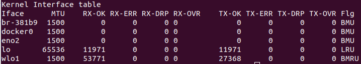

# Step by step to run all Kind tests

This tutorial was tested on a machine with the Ubuntu 22.04.2 LTS operating system. To follow this tutorial, you need the following tools: `git`, `docker`, `docker-compose` and `kind`.

>If `git` isn't installed, install it through the [Installing Git](https://git-scm.com/book/en/v2/Getting-Started-Installing-Git) tutorial.

>If `docker` isn't installed, install it through the [Install Docker Engine](https://docs.docker.com/engine/install/ubuntu/) tutorial.

>If `docker-compose` isn't installed, install it through the [Install Docker Compose](https://docs.docker.com/compose/install/standalone/) tutorial.

>If `kind` isn't installed, install it through the [Installation](https://kind.sigs.k8s.io/docs/user/quick-start/#installation) tutorial.

To make sure the required tools are installed, run the following commands:
```bash
git --version
```
>git version 2.34.1

```bash
docker --version
```
>Docker version 24.0.2, build cb74dfc

```bash
docker-compose --version
```
>Docker Compose version v2.18.1

```bash
kind --version
```
>kind version 0.19.0

__1__. If the __kind-examples__ repository has not yet been cloned, clone it by running the following commands:
```bash
cd YOUR_PATH
git clone https://github.com/cams83/kind-examples.git
```

__2__. Run the QuickStart examples.
```bash
cd YOUR_PATH/kind-examples/QuickStart
kind create cluster --image kindest/node:v1.27.2 --config kind-example-config1.yaml --name multiple-nodes
kind get clusters
kubectl cluster-info --context kind-multiple-nodes
docker ps
kubectl get nodes -o wide
kubectl -n kube-system get all -o wide
kind delete cluster --name multiple-nodes

#Something wrong with this test
kind create cluster --image kindest/node:v1.27.2 --config kind-example-config2.yaml --name ha
kind delete cluster --name ha

kind create cluster --image kindest/node:v1.27.2 --config kind-example-config3.yaml --name mapping-ports
kind delete cluster --name mapping-ports
```

__3__. Run the Ingress examples.
```bash
cd YOUR_PATH/kind-examples/Ingress
kind create cluster --image kindest/node:v1.27.2 --config kind-example-config1.yaml --name ingress

watch kubectl -n ingress-nginx get all
kubectl apply -f https://raw.githubusercontent.com/kubernetes/ingress-nginx/main/deploy/static/provider/kind/deploy.yaml
kubectl wait --namespace ingress-nginx --for=condition=ready pod --selector=app.kubernetes.io/component=controller --timeout=90s

watch kubectl get all
kubectl apply -f usage.yaml
kubectl wait --for=condition=ready pod --selector=app=foo --timeout=90s
kubectl wait --for=condition=ready pod --selector=app=bar --timeout=90s

# should output "foo-app"
curl http://127.0.0.1/foo/hostname
# should output "bar-app"
curl http://127.0.0.1/bar/hostname

kind delete cluster --name ingress
```

__4__. Run the LoadBalancer examples.
```bash
cd YOUR_PATH/kind-examples/LoadBalancer

git update-index --assume-unchanged ${PWD}/metallb-configmap.yaml

export K8S_METALLB_FIRST_ADDRESS=$(docker network inspect -f '{{.IPAM.Config}}' kind | grep -oE "(\b(25[0-5]|2[0-4][0-9]|[01]?[0-9][0-9]?)\b\.){3}0" | sed 's/\.0\.0/.255.240/g')
export K8S_METALLB_LAST_ADDRESS=$(docker network inspect -f '{{.IPAM.Config}}' kind | grep -oE "(\b(25[0-5]|2[0-4][0-9]|[01]?[0-9][0-9]?)\b\.){3}0" | sed 's/\.0\.0/.255.250/g')
sed -i "s/K8S_METALLB_FIRST_ADDRESS-K8S_METALLB_LAST_ADDRESS/${K8S_METALLB_FIRST_ADDRESS}-${K8S_METALLB_LAST_ADDRESS}/g" ${PWD}/metallb-configmap.yaml

kind create cluster --image kindest/node:v1.27.2 --name loadbalancer

watch kubectl get all -n metallb-system
kubectl apply -f https://raw.githubusercontent.com/metallb/metallb/v0.13.7/config/manifests/metallb-native.yaml
kubectl wait --namespace metallb-system --for=condition=ready pod --selector=app=metallb --timeout=90s
kubectl apply -f metallb-configmap.yaml

watch kubectl get all
kubectl apply -f usage.yaml
kubectl wait --for=condition=ready pod --selector=app=http-echo --timeout=90s

LB_IP=$(kubectl get svc/foo-service -o=jsonpath='{.status.loadBalancer.ingress[0].ip}')
for _ in {1..10}; do curl ${LB_IP}:5678; done

kind delete cluster --name loadbalancer
```

Run the following command to list the network interfaces:
```bash
netstat -i
```

In the following example, 5 network interfaces are listed, but only __wlo1__ represents the ethernet network.



Run the following command to view your IP address according to your network interface, in the following command the network interface informed is __wlo1__.
```bash
echo $(ip -4 a s wlo1 | grep -oE '(\b(25[0-5]|2[0-4][0-9]|[01]?[0-9][0-9]?)\b\.){3}\b(25[0-4]|2[0-4][0-9]|[01]?[0-9][0-9]?)\b')
```

__5__. Run the following command to register new local domains. 
>Note: If your network interface is different from __wlo1__, in the command, replace __wlo1__ to your network interface.
```bash
sudo -- sh -c "echo \"$(ip -4 a s wlo1 | grep -oE '(\b(25[0-5]|2[0-4][0-9]|[01]?[0-9][0-9]?)\b\.){3}\b(25[0-4]|2[0-4][0-9]|[01]?[0-9][0-9]?)\b') app.kind.test\" >> /etc/hosts"
```

__6__. Create the `docker` image ___gen-certs:dev___.
```bash
cd YOUR_PATH/kind-examples/tls
docker build -t gen-certs:dev .
```

__7__. With the local domains already registered, a __certificate authority__ will be created and __certificates__ for all new domains will be created too.
>Note: The __certificate authority__ and the __certificates__ wil be created inside `docker` container.
```bash
cd YOUR_PATH/kind-examples/tls
docker run -it --rm --net host -u $(id -u ${USER}):$(id -g ${USER}) -v ${PWD}:/work -w /work gen-certs:dev sh

cfssl gencert -initca ca-csr.json | cfssljson -bare ca
cfssl gencert \
  -ca=ca.pem \
  -ca-key=ca-key.pem \
  -config=ca-config.json \
  -hostname="app.kind.test" \
  -profile=default \
  app.kind.test-csr.json | cfssljson -bare app.kind.test
exit
```

__8__. Run the Ingress NGINX examples.
```bash
cd YOUR_PATH/kind-examples/ingress-nginx

mkdir ${PWD}/certs

cat YOUR_PATH/kind-examples/tls/app.kind.test.pem YOUR_PATH/kind-examples/tls/app.kind.test-key.pem | tee ${PWD}/certs/app.kind.test.pem

git update-index --assume-unchanged ${PWD}/kind-config.yaml
git update-index --assume-unchanged ${PWD}/docker-compose.yaml

export YOUR_IP_ADDRESS=$(ip -4 a s wlo1 | grep -oE "(\b(25[0-5]|2[0-4][0-9]|[01]?[0-9][0-9]?)\b\.){3}\b(25[0-4]|2[0-4][0-9]|[01]?[0-9][0-9]?)\b")
sed -i "s/YOUR_IP_ADDRESS/${YOUR_IP_ADDRESS}/g" ${PWD}/kind-config.yaml
sed -i "s/YOUR_IP_ADDRESS/${YOUR_IP_ADDRESS}/g" ${PWD}/docker-compose.yaml

kind create cluster --image kindest/node:v1.27.2 --config kind-config.yaml --name ingress-nginx

docker cp YOUR_PATH/kind-examples/tls/ca.pem ingress-nginx-control-plane:/usr/local/share/ca-certificates/kind.test.crt && docker exec -it ingress-nginx-control-plane update-ca-certificates

watch kubectl -n ingress-nginx get all,sa,cm,secret -o wide
kubectl apply -f https://raw.githubusercontent.com/kubernetes/ingress-nginx/main/deploy/static/provider/kind/deploy.yaml
kubectl wait --namespace ingress-nginx --for=condition=ready pod --selector=app.kubernetes.io/component=controller --timeout=90s

watch kubectl get all,secret,ing -o wide

kubectl create secret tls app.kind.test --cert=YOUR_PATH/kind-examples/tls/app.kind.test.pem --key=YOUR_PATH/kind-examples/tls/app.kind.test-key.pem

kubectl apply -f usage.yaml
kubectl wait --for=condition=ready pod --selector=app=foo --timeout=90s
kubectl wait --for=condition=ready pod --selector=app=bar --timeout=90s

docker-compose up -d

curl --cacert YOUR_PATH/kind-examples/tls/ca.pem https://app.kind.test/foo
curl --cacert YOUR_PATH/kind-examples/tls/ca.pem https://app.kind.test/bar

docker-compose down
kind delete cluster --name ingress-nginx
```

__9__. Run the Ingress LoadBalancer examples.
```bash
cd YOUR_PATH/kind-examples/ingress-loadbalancer
mkdir ${PWD}/haproxy/certs

cat YOUR_PATH/kind-examples/tls/app.kind.test.pem YOUR_PATH/kind-examples/tls/app.kind.test-key.pem | tee ${PWD}/haproxy/certs/app.kind.test.pem

git update-index --assume-unchanged ${PWD}/kind-config.yaml
git update-index --assume-unchanged ${PWD}/metallb/metallb-configmap.yaml
git update-index --assume-unchanged ${PWD}/docker-compose.yaml

export YOUR_IP_ADDRESS=$(ip -4 a s wlo1 | grep -oE "(\b(25[0-5]|2[0-4][0-9]|[01]?[0-9][0-9]?)\b\.){3}\b(25[0-4]|2[0-4][0-9]|[01]?[0-9][0-9]?)\b")
sed -i "s/YOUR_IP_ADDRESS/${YOUR_IP_ADDRESS}/g" ${PWD}/kind-config.yaml

export K8S_METALLB_FIRST_ADDRESS=$(docker network inspect -f '{{.IPAM.Config}}' kind | grep -oE "(\b(25[0-5]|2[0-4][0-9]|[01]?[0-9][0-9]?)\b\.){3}0" | sed 's/\.0\.0/.255.240/g')
export K8S_METALLB_LAST_ADDRESS=$(docker network inspect -f '{{.IPAM.Config}}' kind | grep -oE "(\b(25[0-5]|2[0-4][0-9]|[01]?[0-9][0-9]?)\b\.){3}0" | sed 's/\.0\.0/.255.250/g')
sed -i "s/K8S_METALLB_FIRST_ADDRESS-K8S_METALLB_LAST_ADDRESS/${K8S_METALLB_FIRST_ADDRESS}-${K8S_METALLB_LAST_ADDRESS}/g" ${PWD}/metallb/metallb-configmap.yaml

sed -i "s/K8S_METALLB_FIRST_ADDRESS/${K8S_METALLB_FIRST_ADDRESS}/g" ${PWD}/docker-compose.yaml

kind create cluster --image kindest/node:v1.27.2 --config kind-config.yaml --name ingress-loadbalancer

docker cp YOUR_PATH/kind-examples/tls/ca.pem ingress-loadbalancer-control-plane:/usr/local/share/ca-certificates/kind.test.crt && docker exec -it ingress-loadbalancer-control-plane update-ca-certificates

watch kubectl -n metallb-system get all,secret,cm,ipaddresspool -o wide
kubectl apply -f metallb/metallb-native.yaml
kubectl wait --namespace metallb-system --for=condition=ready pod --selector=app=metallb --timeout=90s
kubectl apply -f metallb/metallb-configmap.yaml

watch kubectl -n ingress-nginx get all,sa,cm,secret -o wide
kubectl apply -f ingress-nginx/deploy.yaml
kubectl wait --namespace ingress-nginx --for=condition=ready pod --selector=app.kubernetes.io/component=controller --timeout=90s

watch kubectl get all,secret,ing -o wide

kubectl create secret tls app.kind.test --cert=YOUR_PATH/kind-examples/tls/app.kind.test.pem --key=YOUR_PATH/kind-examples/tls/app.kind.test-key.pem

kubectl apply -f usage.yaml
kubectl wait --for=condition=ready pod --selector=app=foo --timeout=90s
kubectl wait --for=condition=ready pod --selector=app=bar --timeout=90s

curl --insecure --resolve "app.kind.test:443:${K8S_METALLB_FIRST_ADDRESS}" https://app.kind.test/foo
curl --insecure --resolve "app.kind.test:443:${K8S_METALLB_FIRST_ADDRESS}" https://app.kind.test/bar

docker-compose up -d

curl --cacert YOUR_PATH/kind-examples/tls/ca.pem https://app.kind.test/foo
curl --cacert YOUR_PATH/kind-examples/tls/ca.pem https://app.kind.test/bar

docker-compose down
kind delete cluster --name ingress-loadbalancer
```

__10__. Run the Ingress LoadBalancer 2 examples.
```bash
cd YOUR_PATH/kind-examples/ingress-loadbalancer2
mkdir ${PWD}/haproxy/certs

cat YOUR_PATH/kind-examples/tls/app.kind.test.pem YOUR_PATH/kind-examples/tls/app.kind.test-key.pem | tee ${PWD}/haproxy/certs/app.kind.test.pem

git update-index --assume-unchanged ${PWD}/kind-config.yaml
git update-index --assume-unchanged ${PWD}/metallb/metallb-configmap.yaml
git update-index --assume-unchanged ${PWD}/docker-compose.yaml

export YOUR_IP_ADDRESS=$(ip -4 a s wlo1 | grep -oE "(\b(25[0-5]|2[0-4][0-9]|[01]?[0-9][0-9]?)\b\.){3}\b(25[0-4]|2[0-4][0-9]|[01]?[0-9][0-9]?)\b")
sed -i "s/YOUR_IP_ADDRESS/${YOUR_IP_ADDRESS}/g" ${PWD}/kind-config.yaml

export K8S_METALLB_FIRST_ADDRESS=$(docker network inspect -f '{{.IPAM.Config}}' kind | grep -oE "(\b(25[0-5]|2[0-4][0-9]|[01]?[0-9][0-9]?)\b\.){3}0" | sed 's/\.0\.0/.255.240/g')
export K8S_METALLB_LAST_ADDRESS=$(docker network inspect -f '{{.IPAM.Config}}' kind | grep -oE "(\b(25[0-5]|2[0-4][0-9]|[01]?[0-9][0-9]?)\b\.){3}0" | sed 's/\.0\.0/.255.250/g')
sed -i "s/K8S_METALLB_FIRST_ADDRESS-K8S_METALLB_LAST_ADDRESS/${K8S_METALLB_FIRST_ADDRESS}-${K8S_METALLB_LAST_ADDRESS}/g" ${PWD}/metallb/metallb-configmap.yaml

sed -i "s/K8S_METALLB_FIRST_ADDRESS/${K8S_METALLB_FIRST_ADDRESS}/g" ${PWD}/docker-compose.yaml

mkdir ${PWD}/tls
cp YOUR_PATH/kind-examples/tls/*.pem ${PWD}/tls/

docker build -t k8s-env:dev -f ${PWD}/Dockerfile .

kind create cluster --image kindest/node:v1.27.2 --config kind-config.yaml --name ingress-loadbalancer2

docker cp YOUR_PATH/kind-examples/tls/ca.pem ingress-loadbalancer2-control-plane:/usr/local/share/ca-certificates/kind.test.crt && docker exec -it ingress-loadbalancer2-control-plane update-ca-certificates

docker run -it --rm --net host \
  -v /var/run/docker.sock:/var/run/docker.sock \
  -v ${HOME}/.kube/:/root/.kube/ \
  -v ${PWD}/tls:/certs \
  -v ${PWD}:/work \
  -v ${HOME}/.ssh:/root/.ssh \
  -v ${HOME}/.gitconfig:/etc/gitconfig \
  -e K8S_METALLB_FIRST_ADDRESS \
  -w /work \
  k8s-env:dev sh

#kubectl version --output=yaml
#helm version

watch kubectl -n metallb-system get all,secret,cm,ipaddresspool -o wide

helm repo add bitnami https://charts.bitnami.com/bitnami && helm repo update
#helm repo list
#helm search repo bitnami
helm install metallb bitnami/metallb --version 4.5.3 --namespace metallb-system --create-namespace
kubectl apply -f /work/metallb/metallb-configmap.yaml
#helm list -n metallb-system

watch kubectl -n ingress-nginx get all,sa,cm,secret -o wide

helm repo add ingress-nginx https://kubernetes.github.io/ingress-nginx && helm repo update
#helm repo list
#helm search repo ingress-nginx
helm install ingress-nginx ingress-nginx/ingress-nginx --version 4.7.0  --namespace ingress-nginx --create-namespace --values /work/ingress-nginx/ingress-nginx-values.yaml
kubectl wait --namespace ingress-nginx --for=condition=ready pod --selector=app.kubernetes.io/component=controller --timeout=90s
#helm list -n ingress-nginx

watch kubectl get all,secret,ing -o wide

kubectl create secret tls app.kind.test --cert=/certs/app.kind.test.pem --key=/certs/app.kind.test-key.pem

kubectl apply -f /work/usage.yaml
kubectl wait --for=condition=ready pod --selector=app=foo --timeout=90s
kubectl wait --for=condition=ready pod --selector=app=bar --timeout=90s

curl --resolve "app.kind.test:443:${K8S_METALLB_FIRST_ADDRESS}" https://app.kind.test/foo
curl --resolve "app.kind.test:443:${K8S_METALLB_FIRST_ADDRESS}" https://app.kind.test/bar

exit

docker-compose up -d

curl --cacert ${PWD}/tls/ca.pem https://app.kind.test/foo
curl --cacert ${PWD}/tls/ca.pem https://app.kind.test/bar

docker-compose down
kind delete cluster --name ingress-loadbalancer2
```